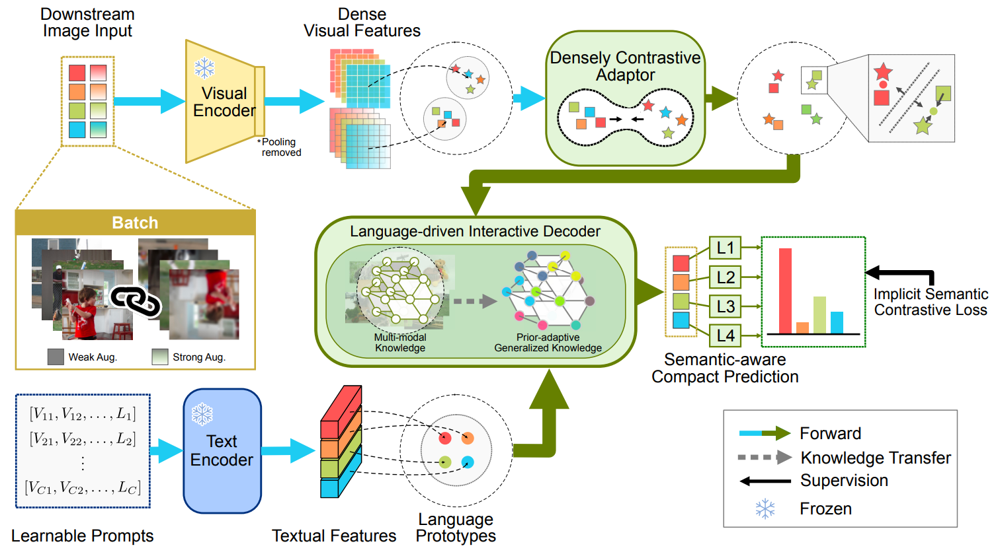

# LDSA: Language-driven Dense Semantic Adaptor

Official implementation of **"Adapting Dense Vision-Language Relationships for Multi-label Classification with Partial Label"** (submitted to *IEEE TPAMI*).

---

## Abstract

Learning multi-label image classification with incomplete annotations is a challenging task that has been widely studied for its superior trade-off between high efficiency and less labor consumption on large-scale datasets. Predominant methods rely on strong prior assumptions to recover the missing semantics from partial annotations. However, these statistic priors suffer from unstable semantic mistakes and thus lead to catastrophic overfitting. Toward this end, we propose a **Language-driven Dense Semantic Adaptor (LDSA)** that excavates prior-adaptive relationships from multimodal pretrained CLIP models. In our approach, the densely contrastive adaptor is first proposed to construct dense visual contrastive constraints, transferring the task-specific knowledge to visual domains. We then propose a language-driven interactive decoder with the help of class-specific prompt tuning, which adapts language proxies with visual domains. With the collaborative learning of proposed modules, experimental results demonstrate our proposed LDSA achieves a new state of the art on public multi-label classification benchmarks, and interpretable analyses reveal that our LDSA discovers implicit semantic relationships with the prior-adaptive learning scheme.



## Installation

Python 3.10+ is recommended.

```bash
pip install torch torchvision pillow
```

## Dataset

The evaluator expects a COCO2014 root with the following files:

```
<data-root>/
  val2014/                # raw val images
  val_annotation.json     # [{"file_name": "...", "labels": [cat_idx, ...]}, ...]
  category.json           # {"person": 0, "bicycle": 1, ...}  (80 classes)
```

## Evaluation

Evaluate an EMA checkpoint on COCO2014 val and print mAP:

```bash
python eval_mixman10_standalone.py \
    --ckpt /path/to/checkpoint.pth \
    --data-root /path/to/coco2014
```

Flags:

- **`--ckpt`**: path to a `.pth` checkpoint.
- **`--data-root`**: COCO2014 root with the layout shown above.

## More

Some naming details in the code have not yet been fully aligned with the paper.

We plan to release the complete code after the paper is accepted.

## Citation

If you find this work useful, please cite:

```bibtex
@article{chen2024ldsa,
  title   = {Adapting Dense Vision-Language Relationships for Multi-label Classification with Partial Label},
  author  = {Chen, Cheng and Zhao, Yifan and Li, Jia},
  journal = {IEEE Transactions on Pattern Analysis and Machine Intelligence},
  year    = {2024},
  note    = {Under review}
}
```
